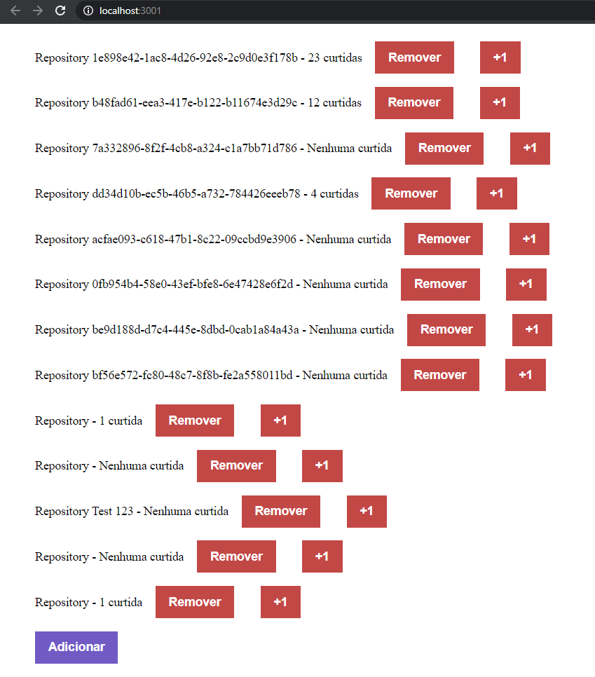

# React JS - Concepts



A simple React JS based webpage that displays and updates data using the [repositories API.](https://github.com/rafaelgalani/repositories-app)

## Build and Run

```
yarn & yarn start
```